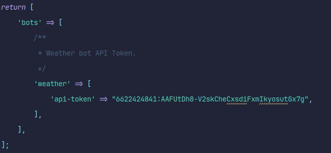
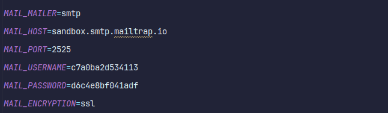

# CLICK-TASK: Weather API through CLI

## Конфигурация
Если вы хотите использовать Telegram и почту, вам необходимо настроить файлы конфигурации: `telegram.php`

Поместите свой токен API бота Telegram для отправки сообщения:


Чтобы отправить почту, настройте файл .env (для проверки рекомендуется использовать mailtrap):


## Документация
Вы можете использовать этот проект с помощью команды `php artisan weather` в терминале. 

``` bash
php artisan weather {provider} {city} {channel}:{chat_id/mail}
```

### Провайдеры
Существует два провайдера для использования:
1. `open-weather-map`
2. `weather-api`

Для тестирования вы можете запустить команду:
``` bash
php artisan weather open-weather-map {city} {channel}:{chat_id/mail}
```

### Город
Вы можете написать любой город мира
``` bash
php artisan weather open-weather-map Tashkent {channel}:{chat_id/mail}
```

### Канал
Можно использовать три канала (со строчными буквами):
1. Telegram (с chat_id пользователя)
``` bash
php artisan weather open-weather-map Tashkent telegram:chat_id
```
2. Mail (любая почта)
``` bash
php artisan weather open-weather-map Tashkent mail:test@example.com
```
3. Console (или пустая)
``` bash
php artisan weather open-weather-map Tashkent
```
